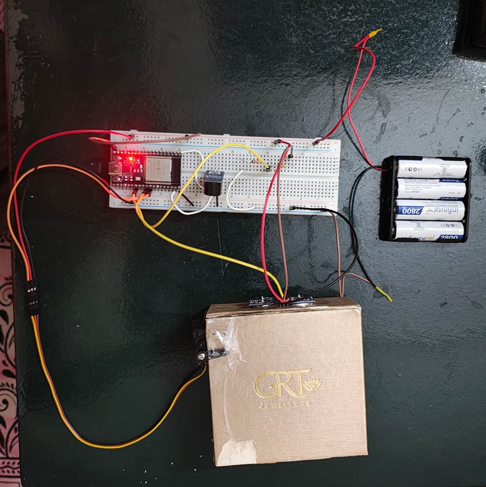
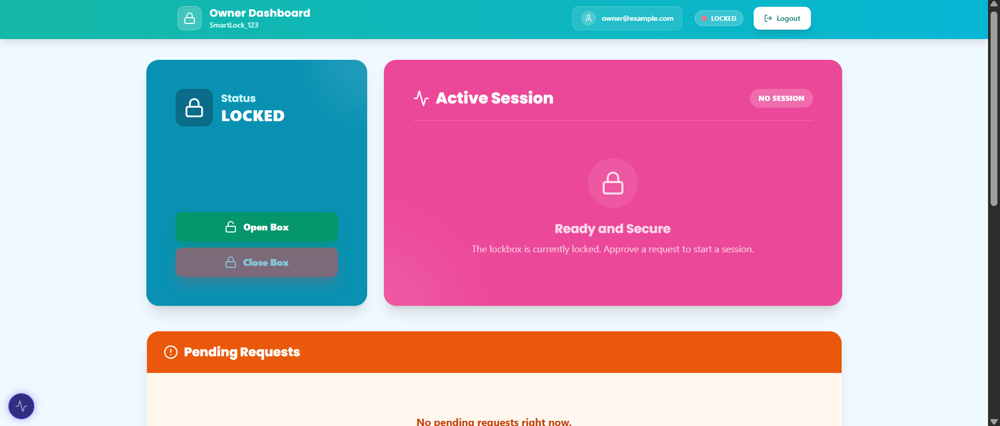
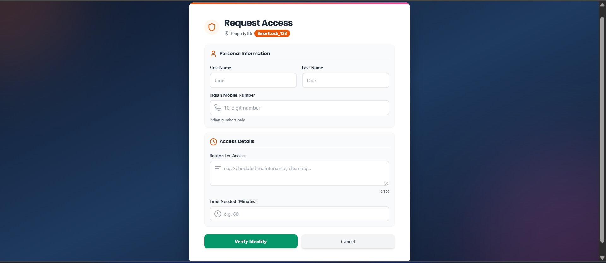
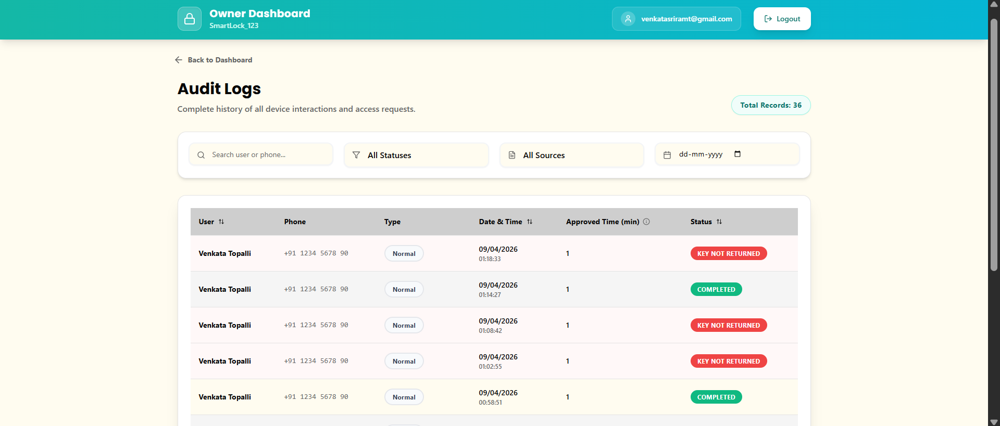
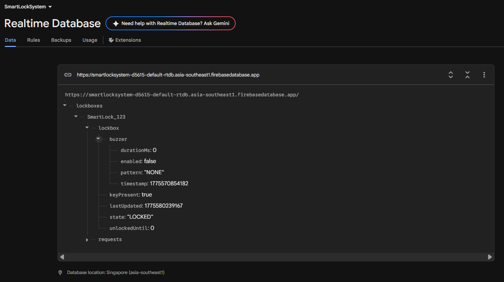

# 🔐 Smart Lockbox System

An IoT-based smart lockbox that enables secure, remote access to physical keys using an ESP32 microcontroller, Firebase Realtime Database, and a web-based interface — with real-time verification that the key was actually put back.

Old-school metal lockboxes give no record of who opened them or when. This project replaces that with a connected system: access is granted through a web app, the box unlocks on command, and an ultrasonic sensor confirms whether the key was returned before the session closes.



---

## 📌 Overview

The Smart Lockbox is a cyber-physical system spanning three layers:

- **Web Application (Cloud layer)** — Owner and Guest dashboards for granting access, requesting entry, and monitoring status.
- **Firebase Realtime Database (Fog layer)** — shared, real-time state store that synchronizes commands and sensor feedback between the web app and the hardware.
- **ESP32 + peripherals (Edge layer)** — servo motor, ultrasonic sensor, and buzzer connected to an ESP32, executing physical actions and reporting sensor state back to Firebase.

```
User → Web App → Firebase → ESP32 → Hardware (Servo, Sensor, Buzzer)
                     ↑
                     └──── Sensor Feedback → Firebase → UI
```

What sets this apart from commercial options (Master Lock 5441EC, Igloohome Keybox 3): those can confirm the box was *opened*, but not that the key was *returned*. This project adds ultrasonic key-presence detection so an unreturned key triggers a buzzer alert and a logged event — instead of silently trusting that it's back inside.

---

## ⚙️ Features

- 🔓 Remote lock/unlock via the web interface
- 📡 Real-time synchronization using Firebase (stream-based, not polling)
- 🔑 Key presence + return detection using an ultrasonic sensor, with debounced/stable-reading confirmation
- 🔔 Buzzer alerts for return warnings and timeouts
- 👤 Role-based UI (Owner & Guest), with OTP-based guest verification
- ⚡ Event-driven, dual-core firmware (network task and hardware task run independently on the ESP32's two cores)
- 🧾 Full audit log of requests and access history

---

## 📁 Project Structure

```
smart-lockbox/
├── esp32/                       # ESP32 firmware (.ino)
├── website/                     # React + Vite web app (Owner/Guest dashboards)
├── docs/
│   ├── circuit-documentation.md # Wiring reference + circuit diagram
│   ├── images/                  # Circuit diagram, hardware photo, UI screenshots
│   └── reports/                 # Full written reports (see below)
└── README.md
```

---

## 🧰 Hardware Components

| Component | Spec |
|---|---|
| ESP32-WROOM-32 | Dual-core 240MHz, Wi-Fi 802.11 b/g/n |
| TowerPro MG90S Micro Servo | 180° rotation, lock actuator |
| HC-SR04 Ultrasonic Sensor | 2–400cm range, 40kHz — key presence detection |
| ADIY Active Buzzer Module | Audible alerts |
| 4× AA Ni-MH Batteries (2800mAh) | 4.8V power supply |
| 1000µF Electrolytic Capacitor | Smooths voltage transients from servo/buzzer |
| 10kΩ Resistors ×3 | Signal-line protection |

Full wiring details: [`docs/circuit-documentation.md`](docs/circuit-documentation.md)

**Prototype cost:** ~₹11,481 (~$137 USD), including web app/Firebase development — see the [Combined Report](docs/reports/Smart_Lockbox_Combined_Report.pdf) for the full bill of materials and cost comparison against commercial alternatives.

---

## 🌐 Technologies Used

- Embedded C++ (Arduino framework for ESP32)
- Firebase Realtime Database + Firebase Auth
- React (Vite) + Tailwind CSS
- Wi-Fi / stream-based real-time communication

---

## 🚀 Setup Instructions

### 1. Clone the repository

```bash
git clone https://github.com/venkatasriramt-spec/smart-lockbox.git
cd smart-lockbox
```

### 2. Website setup

```bash
cd website
npm install
npm run dev
```

Configure your own Firebase project credentials — see [`website/README.md`](website/README.md) for details. No real API keys are included in this repo.

### 3. ESP32 setup

1. Open `esp32/smart_lockbox.ino` in the Arduino IDE.
2. Install required libraries: `WiFi.h`, `Firebase_ESP_Client`, `ESP32Servo`.
3. Update the placeholder credentials at the top of the file:
   ```cpp
   #define WIFI_SSID "YOUR_WIFI_NAME"
   #define WIFI_PASSWORD "YOUR_WIFI_PASSWORD"
   #define API_KEY "YOUR_API_KEY"
   #define DATABASE_URL "FIREBASE_DATABASE_URL"
   ```
4. Upload to the ESP32.

---

## 🔄 Working Principle

1. Owner/guest sends a command (`LOCKED` / `UNLOCKED`) from the web app.
2. Firebase updates the shared database node.
3. The ESP32 receives the change via a Firebase stream (no polling) within ~100–300ms.
4. Core 1 on the ESP32 moves the servo to open/close the box.
5. While unlocked, the ultrasonic sensor takes distance readings every 150ms to check key presence, requiring a 1-second stable reading before accepting a state change.
6. If the key isn't returned before the configured deadline, the buzzer sounds and a `KEY_NOT_RETURNED` alert is logged.
7. Sensor-derived status is written back to Firebase, updating the UI in real time.

---

## 📊 Key Functional Modules

- **Control Module** — lock/unlock command handling
- **Sensing Module** — ultrasonic key detection with debounce
- **Actuation Module** — servo motor control
- **Alert Module** — buzzer notification patterns
- **Cloud Sync Module** — Firebase communication (dual-core split between network and hardware tasks)

---

## 🖼️ Screenshots

| Owner Dashboard | Guest Access Request |
|---|---|
|  |  |

| Audit Logs | Firebase Realtime Database |
|---|---|
|  |  |

More screenshots in [`docs/images/`](docs/images/).

---

## 📄 Documentation & Reports

| Document | Description |
|---|---|
| [`docs/circuit-documentation.md`](docs/circuit-documentation.md) | Component list, wiring details, and circuit diagram |
| [`docs/reports/Smart_Lockbox_Combined_Report`](docs/reports/Smart_Lockbox_Combined_Report.pdf) | **Most complete report** — consolidated Review 1+2+3, covering architecture, algorithm design, calibration, test cases, and performance metrics |
| [`docs/reports/IEEE_Report.pdf`](docs/reports/IEEE_Report.pdf) | Conference-style paper submitted for conference-paper consideration |
| [`docs/reports/IDF-B_Invention_Disclosure`](docs/reports/IDF-B_Invention_Disclosure.pdf) | Invention Disclosure Format document submitted as part of a patent application |

> **Status:** The IEEE paper and the patent disclosure are *submitted*, pending review — no acceptance, publication, or grant has been confirmed yet.

---

## 👨‍💻 Author

Venkata Sriram Topalli\n
Vellore Institute of Technology, Vellore, India

## 📄 License

This project is for academic and educational purposes.
