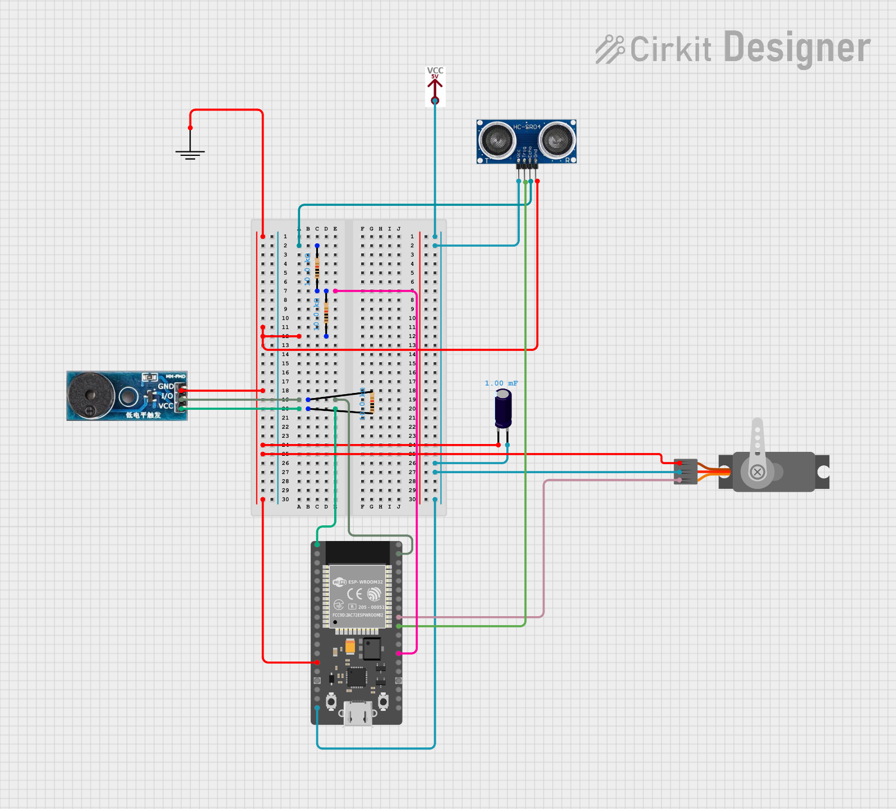

# Circuit Documentation

## Summary

This circuit is a smart lock system built around an ESP32 microcontroller controlling a servo motor, an ultrasonic sensor, and a buzzer module. The system connects to a Wi-Fi network and interacts with a Firebase Realtime Database to manage the lock state and detect key presence. The ultrasonic sensor measures distance inside the box to determine whether a key is present, while the buzzer provides audible alerts based on lock state and key presence.

> **Note on source:** This document was originally auto-generated from a circuit drawn in an online circuit-design tool (Cirkit Designer). The generic component names below (e.g. "VCC 5V" as a standalone block) reflect how the tool models a breadboard layout rather than exact off-the-shelf part numbers. The GPIO pin assignments, however, match the actual firmware (`esp32/smart_lockbox.ino`) and the final build. Where the physical prototype differs from this description (e.g. actual power source is a 4x AA Ni-MH battery pack rather than a generic "VCC 5V" block), see the [Combined Report](reports/Smart_Lockbox_Combined_Report.pdf) for the as-built specifications and bill of materials.

## Component List

| Component | Description | Properties |
|---|---|---|
| Electrolytic Capacitor | Smooths voltage fluctuations, prevents brownout resets during servo current spikes | Capacitance: 1000 µF (as built) |
| Buzzer Module | Audio signaling device used to provide alerts | ADIY active buzzer |
| Servo | Motor used to control the lock mechanism | TowerPro MG90S, 180° rotation |
| Sensor — Ultrasonic HC-SR04 | Measures distance to detect key presence | 40 kHz, 2–400 cm range |
| Power Supply | Provides power to the circuit | 4× AA 1.2V Ni-MH cells (4.8V, 2800 mAh) |
| ESP32 38-PIN | Microcontroller used to control the circuit and connect to Wi-Fi | ESP32-WROOM-32, dual-core |
| GND | Ground connection for the circuit | Common ground |
| Resistor (10kΩ) | Used to limit current / divide voltage | 10,000 Ω, ×3 |

## Wiring Details

### Electrolytic Capacitor
- **Negative (−) Pin**: Connected to GND (common ground)
- **Positive (+) Pin**: Connected to VCC 5V and ESP32 5V pin

### Buzzer Module
- **GND Pin**: Connected to GND (common ground)
- **VCC Pin**: Connected to ESP32 3.3V pin
- **I/O Pin**: Connected to ESP32 GPIO 23 through a 10kΩ resistor

### Servo
- **GND Pin**: Connected to GND (common ground)
- **VCC Pin**: Connected to VCC 5V
- **PWM Pin**: Connected to ESP32 GPIO 18

### Sensor — Ultrasonic HC-SR04
- **Trig Pin**: Connected to ESP32 GPIO 5
- **Echo Pin**: Connected to ESP32 GPIO 4 through a 10kΩ resistor
- **GND Pin**: Connected to GND (common ground)
- **VCC Pin**: Connected to VCC 5V

### ESP32 38-PIN
- **GND Pin**: Connected to GND (common ground)
- **5V Pin**: Connected to VCC 5V
- **3.3V Pin**: Connected to Buzzer Module VCC pin
- **GPIO 23**: Connected to Buzzer Module I/O pin through a 10kΩ resistor
- **GPIO 18**: Connected to Servo PWM pin
- **GPIO 5**: Connected to Sensor Trig pin
- **GPIO 4**: Connected to Sensor Echo pin through a 10kΩ resistor

### Resistors (10kΩ)
- **Resistor 1**: Between Buzzer Module I/O pin and ESP32 GPIO 23
- **Resistor 2**: Between Sensor Echo pin and ESP32 GPIO 4
- **Resistor 3**: Used in the ground network

## Circuit Diagram

## Firmware Behavior

The firmware (`esp32/smart_lockbox.ino`) is written in C++ using the Arduino core for ESP32 and is structured as follows:

- **Wi-Fi Connection** — connects to a specified network using SSID and password.
- **Firebase Setup** — configures Firebase with an API key and database URL; signs up and begins Firebase services.
- **Servo Control** — moves the servo to lock/unlock positions based on the state read from Firebase.
- **Ultrasonic Sensor** — measures distance every 150 ms (while unlocked) to detect key presence, requiring a 1-second stable reading before updating Firebase (debounce).
- **Buzzer Control** — activates timed beep patterns retrieved from Firebase (`WARNING_1_MIN`, `KEY_NOT_RETURNED`).
- **Dual-core split** — Core 0 handles the Firebase stream/network task; Core 1 handles servo, buzzer, and sensor logic, avoiding blocking operations on the hardware-critical loop.

See the [Combined Report](reports/Smart_Lockbox_Combined_Report.pdf) for calibration details, test cases, and performance metrics.
